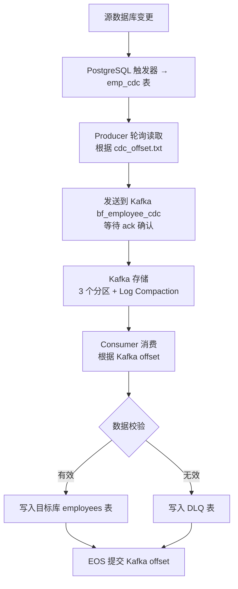

# 完整数据流程说明

## 📊 数据流程（从头到尾）

### **1️⃣ 源数据库有变更**
- 用户在**源数据库**（端口 5432）里插入/更新/删除员工数据
- 例如：插入一个新员工 `emp_id=1001`

### **2️⃣ 触发器自动记录变更**
- PostgreSQL 触发器自动把变更写入 **`emp_cdc` 表**
- 记录内容：
  - `action_id`：变更编号
  - `emp_id`：员工 ID
  - `action`：INSERT/UPDATE/DELETE
  - `first_name, last_name, dob, city, salary`：员工数据

### **3️⃣ Producer 轮询读取**
- **Producer 程序**（`src/producer.py`）每 5 秒检查一次 `emp_cdc` 表
- 读取新的变更记录（根据 `cdc_offset.txt` 记住上次读到哪了）

### **4️⃣ 发送到 Kafka**
- Producer 把变更数据序列化成 JSON
- 根据 `emp_id` 作为 key 发送到 **Kafka 主题 `bf_employee_cdc`**
- Kafka 根据 key 分配到 3 个分区之一（0/1/2）
- Producer 等待 **ack**（Kafka 确认收到消息）

### **5️⃣ Kafka 存储消息**
- Kafka 把消息存在对应分区里
- **启用 Log Compaction**：只保留每个 `emp_id` 的最新值（节省空间）
- **启用幂等性**：自动去重（即使 Producer 重复发送也不会重复）

### **6️⃣ Consumer 消费消息**
- **Consumer 程序**（`src/consumer.py`）从 Kafka 拉取消息
- 配置：`isolation.level=read_committed`（只读已提交的消息）

### **7️⃣ 数据校验**
- Consumer 解析 JSON，创建 `Employee` 对象
- 调用 `employee.validate()` 检查：
  - 出生年份 >= 1990
  - 薪资 >= 10000
  - 员工 ID >= 0

### **8️⃣ 写入目标库或 DLQ**
**如果数据有效：**
- 根据 `action` 类型：
  - `INSERT/UPDATE`：UPSERT 到**目标数据库**（端口 5433）的 `employees` 表
  - `DELETE`：从目标库删除记录

**如果数据无效：**
- 写入**目标数据库**的 `emp_cdc_dlq` 表（死信队列）
- 记录错误原因

### **9️⃣ EOS 手动提交 offset**
- Consumer 处理完一条消息后
- 调用 `commit(asynchronous=False)` 同步提交 offset
- **保证原子性**：数据库写入 + offset 提交一起成功或一起失败

### **🔟 Offset Explorer 可视化**
- 在 Offset Explorer 可以看到：
  - **Topics**：消息存在哪里
  - **Partitions**：消息分配到哪个分区
  - **Consumers**：谁在读消息
  - **Offset**：读到第几条
  - **Lag**：还差多少条没读

---

## 🔄 流程图



---

## 📌 重要概念对比

### **ack vs offset**

| 概念 | 谁用 | 作用 | 存储位置 |
|------|------|------|----------|
| **ack（确认）** | Producer | Kafka 告诉 Producer "我收到消息了" | 不存储，只是确认信号 |
| **Kafka offset** | Consumer | 记录"我读到 Kafka 第几条消息" | Kafka `__consumer_offsets` |
| **CDC offset** | Producer | 记录"我读到源数据库 emp_cdc 第几行" | 本地 `cdc_offset.txt` |

### **两种 offset 的区别**

**Producer 的 cdc_offset.txt**：
```
记录源数据库 emp_cdc 表的 action_id
例如：上次读到 action_id=100
下次只查询 WHERE action_id > 100
```

**Consumer 的 Kafka offset**：
```
记录 Kafka 主题的消息编号
例如：Partition 0 读到 offset=50
下次从 offset=51 开始消费
```

---

## ⚡ EOS（Exactly Once Semantics）保证

1. **Producer 端**：
   - 启用幂等性（`enable.idempotence=True`）
   - Kafka 自动去重重复消息

2. **Consumer 端**：
   - 禁用自动提交（`enable.auto.commit=False`）
   - 手动提交 offset（`commit(asynchronous=False)`）
   - 数据库写入 + offset 提交原子操作

**结果**：消息恰好处理一次，不丢失、不重复。

---

## 一句话总结

**源库变更 → 触发器记录 → Producer 读取 → Kafka 传输 → Consumer 消费 → 校验后写入目标库或 DLQ → 提交 offset。**
